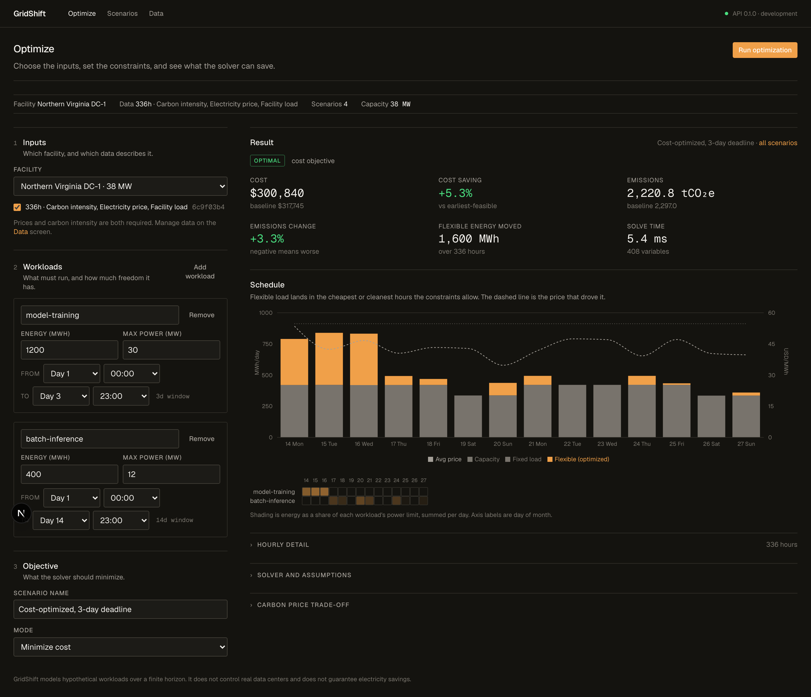
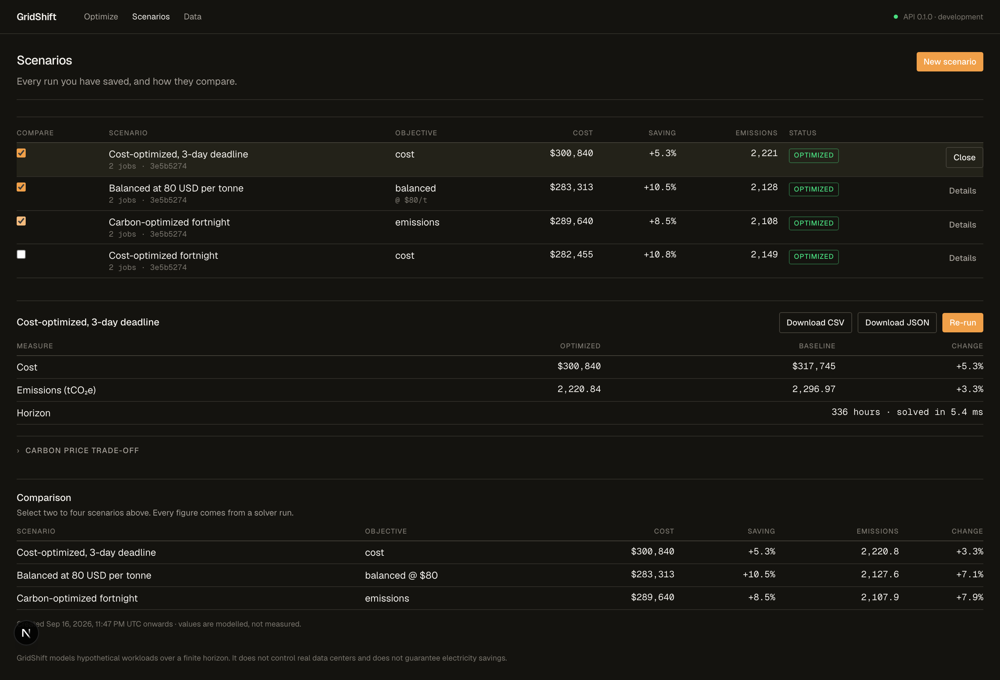

# GridShift — Open-Source Data Center Energy Optimization

Integrating public energy data, mathematical programming, and interactive analytics to model
cost and emissions trade-offs in flexible computing workloads.

**[Live demo](https://gridshift-web-production.up.railway.app)** · [Optimization model](docs/OPTIMIZATION.md) · [Architecture](docs/ARCHITECTURE.md) · [Data sources](docs/DATA_SOURCES.md)



## What this is

GridShift is a decision-support tool for data-center operations, energy procurement, and
sustainability analysts. It combines weather data, uploaded electricity prices and carbon
intensity, and explicit workload constraints into one analytical model, then solves for a
lower-cost or lower-emission operating schedule.

The optimization engine is the product, not the dashboard. Every recommendation is:

- **Mathematically feasible** — produced by a linear program that enforces workload
  completion, electrical capacity, per-job power limits, and release/deadline windows.
- **Reproducible** — each run archives an immutable snapshot of its inputs, identified by a
  content checksum.
- **Traceable** — every observation records its source, units, and whether it was supplied,
  retrieved, or synthetic.

## Measured results

The sample facility below is a synthetic 24-hour profile with a morning ramp and an evening
peak. The baseline is the deterministic earliest-feasible schedule, which front-loads work
into the expensive morning hours.

| Scenario | Optimized cost | Baseline cost | Cost saving | Optimized emissions | Emissions change |
| --- | --- | --- | --- | --- | --- |
| Minimize cost | $23,592 | $26,340 | **+10.44%** | 161.15 tCO₂e | +6.68% |
| Minimize emissions | $23,751 | $26,340 | +9.83% | 160.55 tCO₂e | **+7.03%** |
| Balanced @ $80/tCO₂e | $23,606 | $26,340 | +10.38% | 160.63 tCO₂e | +6.98% |

Reproduce these figures with `make seed`. Note that emissions mode achieves a *larger*
emissions reduction at a *slightly higher* cost than cost mode — that trade-off is the point
of the product, and it is reported rather than smoothed away.

Solver performance, measured as the median of seven runs of the full `solve()` call on
Apple silicon with `SOLVER_TIME_LIMIT_SECONDS=5`:

| Scenario | Variables | Median solve time |
| --- | --- | --- |
| 24 hours, 1 workload | 24 | 1.3 ms |
| 24 hours, 10 workloads | 240 | 2.1 ms |
| 168 hours, 100 workloads | 16,800 | 80 ms |

The requirement was a 24-hour scenario in under 5 seconds. The observed figure is roughly
three orders of magnitude inside it.

## The trade-off frontier

Sweeping the carbon price runs the solver once per price and plots the outcomes. Each point
is a full solve, so the curve is the model's own frontier rather than a smoothed
illustration. The dashed lines mark the earliest-feasible baseline.



Sweeping is exploration, not a saved result — nothing is persisted, so a study does not
pollute the user's scenario history.

## The model

For each workload `j` and hour `t`, the decision variable `x[j,t] ≥ 0` is the energy (MWh)
committed to job `j` during hour `t`. Total facility consumption is
`E[t] = b[t] + Σ_j x[j,t]`, where `b[t]` is the fixed, non-shiftable load.

| Mode | Objective |
| --- | --- |
| `cost` | `min Σ_t p[t] · E[t]` |
| `emissions` | `min Σ_t c[t] · E[t]` |
| `balanced` | `min Σ_t (p[t] + λ·c[t]) · E[t]` |

Subject to workload completion, capacity `b[t] + Σ_j x[j,t] ≤ K[t]`, processing limits
`0 ≤ x[j,t] ≤ M[j]`, and zero allocation outside each job's `[release, deadline]` window.
`λ` is an explicit carbon price in USD per tonne CO₂e.

Balanced mode prices carbon **before** combining, so dollars are never added to tonnes. The
combined objective is never the number shown to the user: cost and emissions are always
reported separately, because they are the two quantities the model trades off.

Solved with `scipy.optimize.linprog(method="highs")`. The problem is continuous and linear,
so a mixed-integer solver would be strictly more expensive for no benefit. Full formulation,
baseline definition, and the three distinct infeasibility cases are in
[`docs/OPTIMIZATION.md`](docs/OPTIMIZATION.md).

### Three details that matter

**The baseline is validated, not assumed.** A saving is only meaningful against a schedule
that is itself valid. The earliest-feasible baseline (earliest deadline, then earliest
release, then job id) satisfies every hard constraint, and if it cannot, GridShift reports
that no valid baseline exists rather than comparing against an infeasible one.

**Negative results stay visible.** Optimizing cost can raise emissions and vice versa. A
dashboard that hid that would misrepresent the trade-off the product exists to expose.

**The solver is checked against the problem.** After solving, the schedule is verified
against every hard constraint. A solver answer that breaks one is downgraded to
`numerical_error` rather than presented as usable.

## Architecture

```
Browser ──HTTPS──► gridshift-web ──private network──► gridshift-api ──► PostgreSQL
  (Next.js)          (Next.js proxy)                   (FastAPI + SciPy)
```

The browser only talks to the Next.js origin. The API has no public domain and is reachable
only over Railway's private network, so there is no CORS surface to misconfigure. See
[`docs/ARCHITECTURE.md`](docs/ARCHITECTURE.md).

| Layer | Technology |
| --- | --- |
| Frontend | Next.js 16, TypeScript, Tailwind CSS 4, Recharts |
| Backend | FastAPI, Pydantic, SQLAlchemy, Alembic |
| Optimization | SciPy `linprog` (HiGHS) |
| Database | PostgreSQL in production, SQLite locally |
| Deployment | Railway (three services), GitHub Actions for CI |

## Quick start

Requires Python 3.13+ and Node 20+. No Docker needed — local development uses SQLite.

```bash
make setup          # create the venv and install both applications
make migrate        # create the local database
make sample-data    # generate the synthetic sample facility
make dev            # prints the two commands to run
```

In two terminals:

```bash
make api            # FastAPI  → http://127.0.0.1:8000/docs
make web            # Next.js  → http://localhost:3000
```

Then load the sample facility, dataset, and three optimized scenarios:

```bash
make seed
```

## Testing

```bash
make test           # pytest + vitest
make lint           # ruff + eslint
make typecheck      # mypy + tsc
```

| Suite | Tests | Scope |
| --- | --- | --- |
| `tests/optimization/` | 88 | The model: feasibility, optimality, baseline, DST, negative prices. **100% branch coverage**, gated at 90% in CI. |
| `tests/test_csv_ingest.py` | 48 | Unit canonicalization, duplicates, gaps, timezones, checksums, multi-location rejection |
| `tests/test_api_*.py` | 69 | HTTP contracts, guards, deletes, and the end-to-end scenario flow |
| `tests/test_open_meteo.py` | 17 | Connector normalization, caching, failure modes |
| `tests/test_scenario_builder.py` | 15 | Dataset assembly, ambiguity, horizon intersection |
| `tests/test_timeutil.py` | 12 | UTC normalization and daylight-saving transitions |
| `tests/test_db_types.py` | 13 | Timezone-safe columns, engine wiring, foreign-key enforcement |
| `tests/test_config.py`, `tests/test_health.py` | 11 | Settings parsing, probes |
| `apps/web/tests/` | 16 | API client and formatting |
| **Total** | **289** | |

The essential optimization tests from the brief are covered directly: constant prices produce
a hand-checkable objective value; cheaper hours receive flexible demand; an impossible
deadline returns infeasible; fixed load never moves; every workload completes; capacity is
never exceeded; and neither cost nor emissions optimization ever loses to a feasible
baseline.

## Data sources

| Source | Status | Notes |
| --- | --- | --- |
| CSV upload | MVP, authoritative | Hourly prices and carbon intensity |
| [Open-Meteo](https://open-meteo.com) | MVP, context only | No key required; CC BY 4.0, attribution required |
| [EIA Open Data](https://www.eia.gov/opendata/) | Planned, phase 2 | Historical operating data, not a forward-looking forecast |
| Synthetic sample | Shipped | Reproducible generator, labelled as synthetic |

Uploaded prices and carbon factors are treated as **supplied inputs, not forecasts**. EIA
publishes historical operating data; it does not provide a facility's tariff or a marginal
emissions forecast, and GridShift will not present it as one. Weather is retrieved and
displayed but does not enter the objective without an explicit cooling-load model — the API
states this in every response. Details in [`docs/DATA_SOURCES.md`](docs/DATA_SOURCES.md).

## Deviations from the original specification

Recorded rather than silently absorbed:

| Specified | Built | Why |
| --- | --- | --- |
| Deploy to GitHub Pages | Deployed to Railway | Pages serves static files only; it cannot run FastAPI, PostgreSQL, or a Python solver. |
| Docker Compose locally | SQLite locally, PostgreSQL in production | Docker was unavailable in the development environment. SQLAlchemy abstracts the difference, so this removes a prerequisite without weakening the production topology. |
| Pydantic for the problem model | Frozen dataclasses | Pydantic wraps semantic validation errors in a generic `ValidationError`, hiding the reason a problem is unusable. HTTP contracts still use Pydantic. |
| `pandas` for CSV ingestion | Standard-library `csv` | Ingestion must report precise per-row errors. `pandas` coerces types silently, which conflicts with rejecting rather than repairing. |
| Background job queue | Synchronous solve with a concurrency semaphore | A 24-hour solve takes single-digit milliseconds. |

## Limitations

GridShift models **hypothetical** workloads over a finite horizon. It does **not** control
real data centers and does **not** guarantee electricity savings.

Out of scope for v1: real-time facility control, cloud-provider workload migration, battery
dispatch, electricity market bidding, demand-charge optimization, predictive modelling, and
user authentication. The deployed instance is single-tenant — every visitor sees the same
scenarios.

The model assumes workloads are divisible and preemptible, with no minimum run time or
activation cost. Modelling those requires a mixed-integer formulation.

## License

MIT — see [`LICENSE`](LICENSE). Weather data by [Open-Meteo.com](https://open-meteo.com) (CC BY 4.0).
